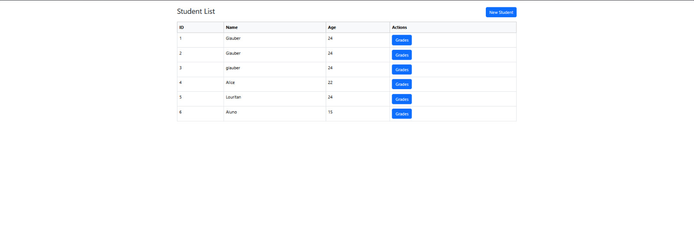
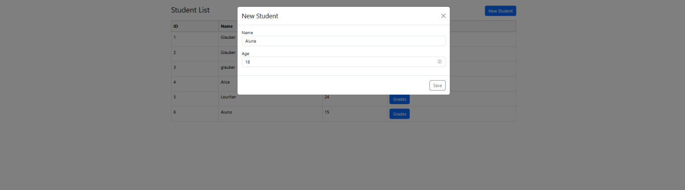
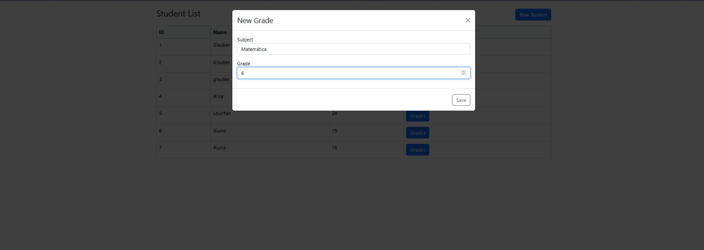
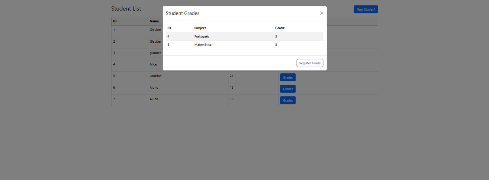
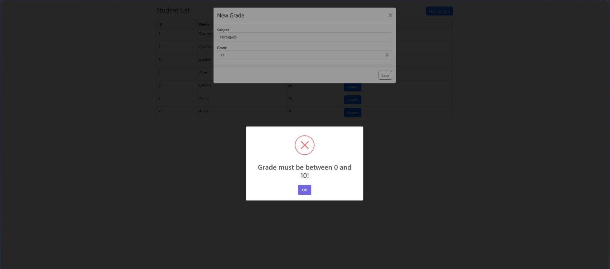

# Sistema de Gerenciamento de Estudantes

## Descrição

Este projeto é uma aplicação frontend desenvolvida em Angular que permite o gerenciamento de estudantes e suas notas. A aplicação oferece funcionalidades para cadastrar novos alunos, registrar notas e visualizar o desempenho acadêmico dos estudantes.

## Funcionalidades

- Cadastro de estudantes
- Registro de notas por disciplina
- Visualização das notas dos estudantes
- Interface responsiva e amigável
- Validação de formulários

## Tecnologias Utilizadas

- Angular 20.1.0
- TypeScript 5.8
- Bootstrap 5.3 / ng-bootstrap 19.0
- Tailwind CSS 4.1
- SweetAlert2 para notificações
- RxJS para programação reativa

## Requisitos

- Node.js (versão 14.x ou superior)
- Angular CLI (versão 20.1.2 ou superior)
- NPM (normalmente instalado com o Node.js)

## Instalação

1. Clone o repositório:
   ```bash
   git clone [URL do seu repositório]
   cd desafio-tecnico-frontend
   ```

2. Instale as dependências:
   ```bash
   npm install
   ```

## Executando o Projeto

Para iniciar o servidor de desenvolvimento:

```bash
ng serve
```

Navegue até `http://localhost:4200/` para acessar a aplicação. A aplicação será recarregada automaticamente se você alterar qualquer um dos arquivos fonte.

## Estrutura do Projeto

```
src/
├── app/
│   ├── components/
│   │   ├── register-student-form/       # Formulário de cadastro de estudantes
│   │   ├── register-student-grade-form/ # Formulário de registro de notas
│   │   └── student-grades-modal/        # Modal para visualização de notas
│   ├── services/
│   │   ├── students.service.ts          # Serviço para gerenciamento de estudantes
│   │   └── student-grade.service.ts     # Serviço para gerenciamento de notas
│   ├── app.config.ts                    # Configurações da aplicação
│   ├── app.routes.ts                    # Configuração de rotas
│   └── app.ts                           # Componente principal da aplicação
└── ...
```

## Compilação para Produção

Para gerar uma versão de produção do projeto:

```bash
ng build
```

Os artefatos de build serão armazenados no diretório `dist/`.

## Testes

### Executando testes unitários

```bash
ng test
```

Os testes unitários são executados com [Karma](https://karma-runner.github.io).

## Screenshots da Aplicação

### Lista de Estudantes


### Modal de Cadastro de Estudante


### Modal de Registro de Notas


### Modal de Visualização de Notas


### Validação de Formulário


## Recursos Adicionais

- Para mais informações sobre o Angular CLI, acesse a [Documentação Oficial do Angular](https://angular.dev/tools/cli).
- [Bootstrap](https://getbootstrap.com/) - Framework CSS utilizado para estilização.
- [Tailwind CSS](https://tailwindcss.com/) - Framework CSS utilizado para estilização.
- [SweetAlert2](https://sweetalert2.github.io/) - Biblioteca para criação de alertas personalizados.
